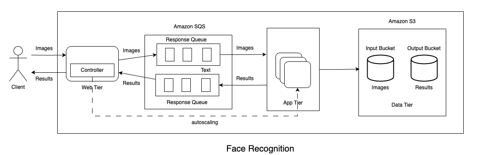

# Multi-Tier Face Recognition Application

This project is a cloud-based, multi-tier face recognition application that processes images of people, identifies faces, and returns their names with minimal latency. The system is designed for scalability and performance, with components distributed across different cloud infrastructure services.

Given an image, the application uses a pre-trained machine learning model (`facenet_pytorch`) to recognize the person in the image. The architecture is composed of three main layers: the Web Tier, App Tier, and a Custom Load Balancer, each with distinct functionalities to ensure smooth and efficient processing.

## Architecture Design



*Figure: System Architecture of the Multi-Tier Face Recognition Application*

### Architecture Overview

The application is divided into three primary components, each hosted in a separate repository:

1. **Web Tier**: Handles HTTP requests, forwards images to the App Tier, and returns results to clients.
2. **App Tier**: Processes images using face recognition and returns the name of the person in the image.
3. **Custom Load Balancer**: Manages scaling of App Tier instances on AWS based on request volume.

### Key Components and Flow

- **Client**: The client sends an image to the Web Tier, which acts as the entry point for processing.
- **Web Tier**: Receives images, forwards them to the App Tier, and returns the recognized results to the client. It also connects to an InfluxDB instance for dummy data population.
- **Amazon SQS**: Used to manage queues between the Web Tier and App Tier, facilitating scalable message passing.
- **App Tier**: Uses a pre-trained face recognition model (`facenet_pytorch`) to process images and return results.
- **Amazon S3**: Stores input images and output results as needed for additional data persistence.
- **Custom Load Balancer**: Monitors incoming request load and dynamically scales App Tier instances on AWS to maintain performance.

### Key Features

- **Distributed Processing**: Each tier operates independently, allowing scalable processing and easy maintenance.
- **Custom Load Balancing**: Manages the App Tier instances dynamically, without relying on AWS's auto-scaling services.
- **Dockerized Deployment**: Each component is containerized, simplifying deployment and ensuring environment consistency.
- **Zero-Downtime CI/CD Pipeline**: Ensures seamless deployment without affecting the application's availability.

# Custom Load Balancer

## Description
The Custom Load Balancer is a unique component of this application that manages the scaling of App Tier instances based on the incoming request load. It automatically adds or removes instances on AWS, bypassing AWS's auto-scaling service to provide a custom scaling solution.

## Features
- **Dynamic Scaling**: Adds or removes App Tier instances based on request volume.
- **AWS Integration**: Manages App Tier instances hosted on AWS.
- **Dockerized**: Containerized for easy deployment alongside other components.

## Tech Stack
- **Programming Language**: Go
- **Dependencies**: AWS SDK for instance management, Docker for containerization

## Environment Variables
The Custom Load Balancer requires the following AWS environment variables to manage instances on AWS:

- `AWS_ACCESS_KEY_ID`: Your AWS access key ID.
- `AWS_SECRET_ACCESS_KEY`: Your AWS secret access key.
- `AWS_DEFAULT_REGION`: The AWS region (e.g., `us-east-1`).
- `AWS_AMI_ID`: The Amazon Machine Image (AMI) ID for launching new instances.
- `AWS_SECURITY_GROUP_ID`: Security Group ID to assign to the instances.
- `AWS_USER_DATA`: User data script for initializing instances.
- `AWS_REQ_URL`: URL for the request queue in Amazon SQS.

Ensure these environment variables are set before running the Load Balancer service.

## Setup

1. **Clone the Repository**
   - Clone this repository and navigate to the project directory:
     ```bash
     git clone <repository-url>
     cd load-balancer
     ```

2. **Export AWS Environment Variables**
   - Set up the necessary AWS environment variables required for the application:
     ```bash
     export AWS_ACCESS_KEY_ID=XXX
     export AWS_SECRET_ACCESS_KEY=XXX
     export AWS_DEFAULT_REGION=XXX
     export AWS_AMI_ID=ami-XXX
     export AWS_SECURITY_GROUP_ID=XXX
     export AWS_USER_DATA=XXX
     export AWS_REQ_URL=XXX
     ```

3. **Build and Run the Docker Container**
   - Build the Docker image:
     ```bash
     docker build -t load-balancer .
     ```
   - Run the container with the environment variables:
     ```bash
     docker run \
       -e AWS_ACCESS_KEY_ID=$AWS_ACCESS_KEY_ID \
       -e AWS_SECRET_ACCESS_KEY=$AWS_SECRET_ACCESS_KEY \
       -e AWS_DEFAULT_REGION=$AWS_DEFAULT_REGION \
       -e AWS_AMI_ID=$AWS_AMI_ID \
       -e AWS_SECURITY_GROUP_ID=$AWS_SECURITY_GROUP_ID \
       -e AWS_USER_DATA=$AWS_USER_DATA \
       -e AWS_REQ_URL=$AWS_REQ_URL \
       load-balancer
     ```

## Deployment using GitHub Actions

The GitHub Actions workflow automates the deployment of the Custom Load Balancer to a server. It builds and pushes the Docker image to GitHub Container Registry (GHCR) and then deploys it to the server via SSH.

### Key Environment Variables for Deployment
- `GHCR_TOKEN`: GitHub Container Registry token for authentication.
- `SSH_PRIVATE_KEY`: Private SSH key for server access.
- `SERVER_USERNAME`: Username for SSH access to the server.
- `SERVER_IP_ADDR`: IP address of the target server.

### Workflow Steps
1. **Build and Push Docker Image**
   - The workflow builds the Docker image and pushes it to GHCR.
2. **Deploy to Server**
   - Connects to the server via SSH, pulls the latest Docker image, and deploys it.
   - The container is run with the necessary AWS environment variables for managing App Tier instances.

Refer to the workflow configuration in `.github/workflows/deploy.yml` for detailed deployment steps.
